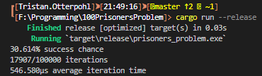

# [100 prisoners problem](https://en.wikipedia.org/wiki/100_prisoners_problem)

## ⚡️ [Problem](https://www.youtube.com/watch?v=iSNsgj1OCLA)
The 100 prisoners problem is a mathematical problem in probability theory and combinatorics. In this problem, 100 numbered prisoners must find their own numbers in one of 100 drawers in order to survive. The rules state that each prisoner may open only 50 drawers and cannot communicate with other prisoners. At first glance, the situation appears hopeless, but a clever strategy offers the prisoners a realistic chance of survival. Danish computer scientist Peter Bro Miltersen first proposed the problem in 2003

## ☘️ Not the Solution

letting each prisoner pick boxes randomly

The odds of succeeding by choosing random boxes is ½ per prisoner. 

The probability of all prisoners finding their number using this method is ½number of prisoners

P(success) ≈ ½100

P(success) ≈ 0.0000000000000000000000000008%

## 🧩 [Solution](https://www.youtube.com/watch?v=iSNsgj1OCLA)

Surprisingly, there is a strategy that provides a survival probability of more than 30%. The key to success is that the prisoners do not have to decide beforehand which boxes to open. Each prisoner can use the information gained from the contents of every box he already opened to decide which one to open next. Another important observation is that this way the success of one prisoner is not independent of the success of the other prisoners, because they all depend on the way the numbers are distributed.

To describe the strategy, not only the prisoners, but also the boxes, are numbered from 1 to 100; for example, row by row starting with the top left drawer. The strategy is now as follows:

    * Each prisoner first opens the box labelled with his own number.
    * If this box contains his number, he is done and was successful.
    * Otherwise, the box contains the number of another prisoner, and he next opens the box labelled with this number.
    * The prisoner repeats steps 2 and 3 until he finds his own number or has opened fifty boxes.

By starting with his own number, the prisoner guarantees he is on a sequence of drawers containing his number. The only question is whether this sequence is longer than fifty drawers.

P(success) ≈ log(2) 

P(success) ≈ 0.30685

## ⚙️ Installation
* Clone the repo `git clone https://github.com/Otterpohl/100PrisonersProblem`
* Run it with Rust since you should already have rust [installed](https://www.rust-lang.org/tools/install) `cargo run --release`

## 🎯 Features
* Literally **_zero clippy suggestions_** (even with pedantic btw)
* **_Blazingly Fast_** - written in 💯% Rust
* **_Scalable_**
* Designed to ease things up for fast development with zero memory allocation and performance in mind.
* 100% code coverage

## 💻 Contributions
**_Discouraged_**

## ⚠️ License
**_free_**

## 🤖 Benchmarks

